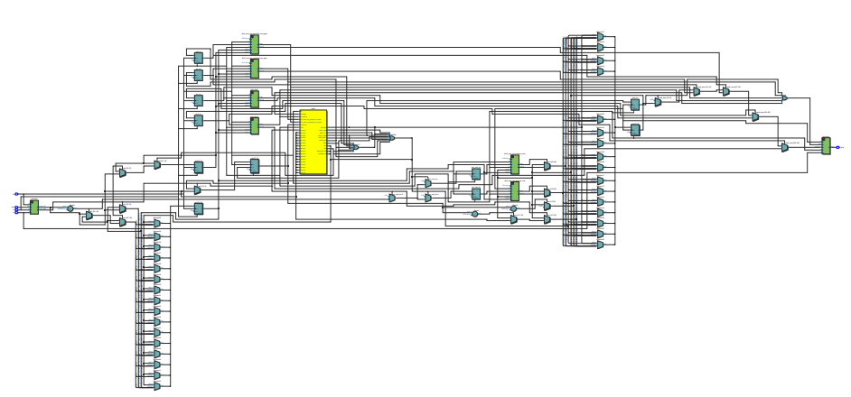
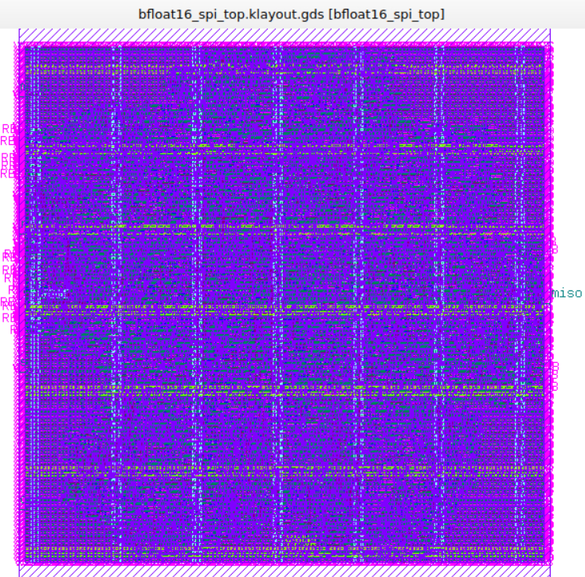

# Chip con interfaz SPI para realizar operaciones aritméticas en formato bfloat16

## Descripción
Este proyecto implementa un chip para realizar operaciones aritméticas en formato bfloat16 (16 bits) a través de una interfaz SPI. El chip soporta operaciones básicas como suma, resta, multiplicación y división, además de instrucciones acumuladas que modifican un registro interno (acumulador). Está diseñado para recibir instrucciones y datos desde un maestro SPI y devolver resultados por la misma interfaz.

El diseño se basa en módulos Verilog reutilizables para las unidades aritméticas y la comunicación SPI, integrados en un módulo top que maneja la lógica de estados para procesar las instrucciones.

## Estructura del Proyecto
- `src/`: Archivos Verilog del diseño, incluyendo módulos para operaciones aritméticas (suma/resta, multiplicación, división) y comunicación SPI (SIPO y PISO).
- `config.json`: Configuración para síntesis y place-and-route con OpenLane.
- `op.sdc`: Constraints de timing para el reloj.
- `pin_order.cfg`: Orden de pines para el layout.
- `dv/`: Testbenches para simulación.
- `runs/`: Resultados de síntesis y layout generados por OpenLane.

## Funcionalidades Implementadas
- **Operaciones básicas**: Suma (ADD2), resta (SUB2), multiplicación (MPY2), división (DIV2) entre dos números bfloat16.
- **Instrucciones acumuladas**: SUM (sumatoria sobre acumulador), SUB (resta acumulada).
- **Control del acumulador**: ZERO (limpiar), SET_ACC (cargar), LOAD_ACC (leer).
- **Interfaz SPI**: Comunicación full-dúplex con transmisión LSB primero.

## Pendiente
- Instrucciones MAC (multiplicación-acumulación) y MAS (multiplicación-substracción) no están implementadas en el código actual.
- Falta verificación completa de casos excepcionales (infinitos, NaN, etc.) en todas las operaciones.
- Faltan simulaciones post-layout.

## Simulaciones
Se realizaron simulaciones comportamentales con testbenches en Verilog. Los resultados muestran tiempos de ejecución variables según la operación (ej. división requiere más ciclos).

## Caracterización
- **Área**: El área del die es de 257,748 μm².
- **Temporización**: Período de reloj de 6.667 ns, con slack positivo en STA post-PnR.
- **Layout**: Generado exitosamente con OpenLane, sin violaciones DRC.

## Layout Final

## Aplicaciones Típicas

Este diseño es ideal para:

- **Sistemas de IA/ML edge**: Aceleración de inferencia con bfloat16
- **Procesamiento de señales**: Cálculos DSP donde se necesita precisión reducida con alta velocidad
- **Sensores inteligentes**: Realizar cálculos en el dispositivo antes de transmitir datos
- **Educación**: Demostrar diseño de chips ASIC con aritmética personalizada

UNIVERSIDAD DEL QUINDÍO
FACULTAD DE INGENIERÍA
PROGRAMA DE INGENIERIA ELECTRÓNICA
ELECTIVA- DISEÑO DE CIRCUITOS INTEGRADOS DIGITALES

Alexander Vera Tasamá
Jorge Iván Marín Hurtado